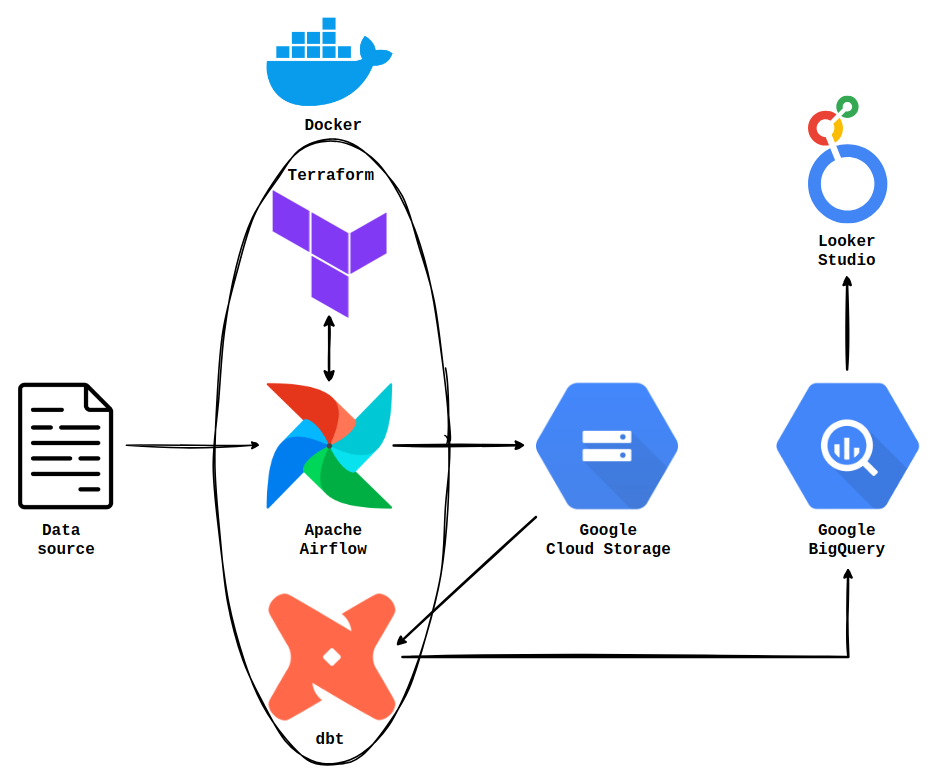

# <div align="center">Sales Data Warehousing & Analysis</div>

## Problem Definition

As a data engineerig/analytics contractor, we have been approached by a new retailer store company that lack a solution for storing and analyzing their sales data. They want us to help them build an end-to-end solution around their data set, and to assist in analyzing and optimizing their data. 

Our plan is to create a data warehouse around their data, and to then build an analytics solution on top, providing actionable insights that will help the company understand trends, identify key opportunities, enhance their sales strategies for sustained growth and success, make data-informed decisions, and improve overall business performance.

## Action Plan

We will be employing the following technologies within this project:

1. __Docker__ - Containerization

2. __Apache Ariflow__ - Pipeline orchestration 

3. __Terraform__ - Deployment of cloud infrastructure

4. __Google Cloud Storage__ - Raw data storage

5. __Google BigQuery__ - Data warehousing

6. __dbt__ - Data warehouse modeling

7. __Looker Studio__ - Data visualization

The diagram below provides a high-level visual representation of the solution we are implementing for our customer:



## The Dataset

Before we begin implementing our solution, we must first inspect the dataset to make sure that the data quality suits our needs:

[Dataset Information and Exploration](./01_dataset/README.md)

The above document can also be found as a notebook [here](./01_dataset/dataset_exploration.ipynb). 

Keep in mind that in order to be able to run the notebook, you must first have _Python_ installed on your machine with _pip_ as the default package manager. Then you can install Jupyter Notebook:

```bash 
$ pip install notebook
```

And start the service:

```bash
$ jupyter notebook
```

Now, you should have the service up and running at http://localhost:8888. You can then navigate to the download location of the [notebook](./01_dataset/dataset_exploration.ipynb) and run it from the Jupyter Notebook Web UI.

## Workflow Orchestration

In this part of the solution, we apply the first four points of the [Action Plan](#action-plan), namely Docker, Apache Airflow, Terraform, and Google Cloud Storage.

Please refer to [Workflow Orchestration](./02_workflow_orchestration/README.md) for a detailed explanation of the work performed, and how to reproduce it.